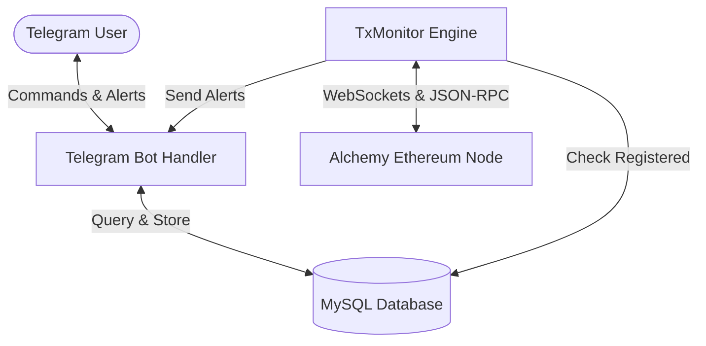

# TxRadarWeb3Bot

Real-time Ethereum blockchain transaction tracking and Telegram notification bot using Alchemy Node. Users can register wallet addresses via Telegram to receive instant alerts on transaction status changes (`Pending` ➔ `Confirmed`). Built with Python, MySQL, and WebSockets.

---

## Key Features

* **Real-Time Stream Monitoring**: Subscribes directly to Alchemy's high-speed WebSocket stream for both native Ethereum transactions and ERC-20 token event logs.
* **Simplified Dual-State Workflow**: Sends alerts instantly when a transaction enters the Mempool (`Pending`) and when it is successfully included in a block (`Confirmed`).
* **ERC-20 Metadata Auto-Caching**: Dynamically queries on-chain token details (`symbol`, `decimals`) for untracked contract addresses and caches them locally to avoid redundant API calls.
* **Custom User Labels**: Allows users to assign alias nicknames to monitored addresses (e.g. *Vitalik*, *My Hot Wallet*), which are displayed dynamically in telegram alerts.
* **User-Specific Notifications**: Distinguishes transactions dynamically as **Deposit**, **Withdrawal**, or **Internal Wallet Transfer** depending on the subscriber's role.

---

## System Architecture



---

## Prerequisites

Before running the application, make sure you have:
* **Python 3.10+** installed.
* **MySQL Server** running and accessible.
* **Alchemy Node API keys** (both HTTP and WebSocket endpoints).
* **Telegram Bot Token** obtained from [@BotFather](https://t.me/BotFather).

---

## Installation & Setup

### 1. Clone the Repository
```bash
git clone https://github.com/Crypto-Claudia/TxRadarWeb3Bot.git
cd TxRadarWeb3Bot
```

### 2. Configure Environment Variables
Copy `.env.example` to `.env` and fill in your actual credentials:
```bash
cp .env.example .env
```
Ensure the variables are populated correctly:
```ini
TELEGRAM_BOT_TOKEN=your_telegram_bot_token
ALCHEMY_WS_URL=wss://eth-mainnet.g.alchemy.com/v2/your_api_key
ALCHEMY_URL=https://eth-mainnet.g.alchemy.com/v2/your_api_key

MYSQL_HOST=localhost
MYSQL_PORT=3306
MYSQL_USER=root
MYSQL_PASSWORD=your_mysql_password
MYSQL_DB=tx_radar
```

### 3. Setup Virtual Environment and Dependencies
It is highly recommended to use a virtual environment:
```bash
# Create virtual environment
python -m venv .venv

# Activate virtual environment
# On Windows:
.venv\Scripts\activate
# On macOS/Linux:
source .venv/bin/activate

# Install required dependencies
pip install -r requirements.txt
```

---

## How to Run

Start the application by running the entry point script:
```bash
python start_bot.py
```
The script will automatically check for the MySQL database, create necessary tables (`users`, `user_addresses`, `tracked_transactions`), initialize the Telegram command listeners, and connect to the Alchemy WebSocket stream.

---

## Telegram Bot Commands

You can interact with the bot using the following commands:

* **`/start`** - Welcome message and quick start guide.
* **`/add <address> [label]`** - Register a new Ethereum wallet address to monitor. You can optionally append a label.
  * *Example:* `/add 0xd8da6bf26964af9d7eed9e03e53415d37aa96045 Vitalik`
* **`/remove <address>`** - Cancel monitoring and remove the wallet address from your list.
* **`/list`** - Show all your registered wallet addresses and their custom labels.
* **`/help`** - View the command guide and details.

---

## License
Distributed under the MIT License. See `LICENSE` for more information.
